# 102 — Visual architecture: per-repo internals + cross-repo interactions

*Per Li 2026-04-27: "create a high-level visual representation
of the workings of every repo, and then a visual of how they
interact together, showing the datatypes, methods and their
signatures."*

This is a comprehensive visual reference for the M0 system as
shipped this session. Per-repo diagrams show types, methods,
and signatures; cross-repo diagrams show the dependency graph,
the running-process graph, and the per-request type flow.

All diagrams are Mermaid — render in Codium, GitHub, or any
CommonMark + Mermaid viewer.

---

## 1 · Cross-repo crate dependency graph

How the seven CANON crates depend on each other. `nota-codec`
and `nota-derive` form the codec layer; `signal` is the wire
schema; `sema` is the record store; `criome` and `nexus` are
the two daemons; `nexus-cli` is the text-shuttle client.

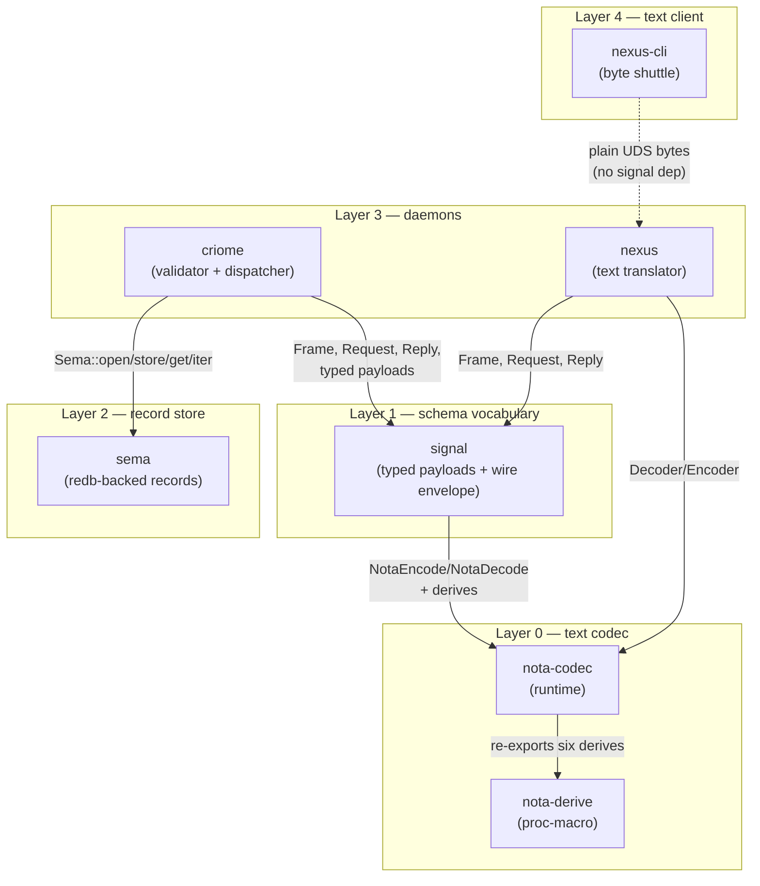

**Key:** dotted line = process-to-process socket boundary; solid
arrow = compile-time crate dependency.

`nexus-cli` deliberately has no `signal` or `nota-codec`
dependency — it is a pure byte shuttle per
[`nexus-cli/ARCHITECTURE.md`](../repos/nexus-cli/ARCHITECTURE.md)
§Boundaries.

---

## 2 · Cross-repo running-process graph

Three processes at runtime: the user invokes `nexus-cli`,
which connects to the long-running `nexus` daemon, which in
turn opens a paired connection to the long-running `criome`
daemon. Each socket carries a different format.

```mermaid
flowchart LR
    user(["user / agent / script"])

    subgraph NexusCLIProc["nexus-cli process<br/>(one-shot)"]
        client["Client::shuttle"]
    end

    subgraph NexusDaemonProc["nexus daemon process<br/>(long-running)"]
        ndaemon["Daemon::run"]
        nconn["Connection::shuttle<br/>(one task per accept)"]
    end

    subgraph CriomeDaemonProc["criome daemon process<br/>(long-running)"]
        clistener["Listener::run"]
        cdaemon["Daemon::handle_frame"]
    end

    subgraph SemaDB["sema database<br/>(redb file)"]
        records[("records table<br/>+ meta table")]
    end

    user -->|".nexus text<br/>via stdin or file"| client
    client -->|"text bytes<br/>UDS /tmp/nexus.sock"| ndaemon
    ndaemon -->|"spawns task"| nconn
    nconn -->|"length-prefixed Frame<br/>UDS /tmp/criome.sock"| clistener
    clistener -->|"per-frame call"| cdaemon
    cdaemon -->|"store/get/iter"| records
    records -->|"bytes"| cdaemon
    cdaemon -->|"Reply Frame"| clistener
    clistener -->|"length-prefixed Frame"| nconn
    nconn -->|"rendered text bytes"| client
    client -->|"stdout"| user
```

**Sockets:**
- `/tmp/nexus.sock` — pure nexus text. No framing other than
  matched parens. The CLI half-closes its write side after
  sending; the daemon reads to EOF, processes, writes the
  rendered reply, closes.
- `/tmp/criome.sock` — length-prefixed signal Frames (4-byte
  big-endian length + N rkyv bytes per
  [`signal/ARCHITECTURE.md`](../repos/signal/ARCHITECTURE.md)
  §"Wire format"). Replies pair to requests by FIFO position.

---

## 3 · Cross-repo type flow per request

What types travel through each boundary for a single
`(Node "User")` round-trip. This sequence shows the same
journey as §2 but typed — at every arrow you can see the
exact type that crosses.

```mermaid
sequenceDiagram
    participant User as user
    participant Cli as nexus-cli<br/>Client
    participant NDaemon as nexus daemon<br/>Daemon → Connection
    participant Parser as nexus<br/>Parser
    participant Link as nexus<br/>CriomeLink
    participant Renderer as nexus<br/>Renderer
    participant CListener as criome<br/>Listener
    participant CDaemon as criome<br/>Daemon
    participant Sema as sema<br/>Sema

    User->>Cli: "(Node \"User\")"<br/>(text bytes)
    Cli->>NDaemon: text bytes via UnixStream
    NDaemon->>Parser: Parser::new(&text)
    Parser-->>NDaemon: Request::Assert(<br/>AssertOperation::Node(Node{name:"User"}))

    Note over NDaemon,Link: First request opens link
    NDaemon->>Link: CriomeLink::open(criome_socket)
    Link->>CListener: Frame{Body::Request(<br/>Request::Handshake(...))}
    CListener->>CDaemon: handle_frame(Frame)
    CDaemon-->>CListener: Frame{Body::Reply(<br/>Reply::HandshakeAccepted(...))}
    CListener-->>Link: Frame
    Link-->>NDaemon: CriomeLink (post-handshake)

    NDaemon->>Link: link.send(Request::Assert(...))
    Link->>CListener: Frame{Body::Request(<br/>Request::Assert(AssertOperation::Node(...)))}
    CListener->>CDaemon: handle_frame(Frame)
    CDaemon->>CDaemon: handle_request → handle_assert
    CDaemon->>Sema: sema.store(tagged_bytes) → Slot
    Sema-->>CDaemon: Result<Slot>
    CDaemon-->>CListener: Frame{Body::Reply(<br/>Reply::Outcome(<br/>OutcomeMessage::Ok(Ok)))}
    CListener-->>Link: Frame
    Link-->>NDaemon: Reply::Outcome(<br/>OutcomeMessage::Ok(Ok))

    NDaemon->>Renderer: render_reply(&reply)
    Renderer-->>NDaemon: () (output buffer now contains "(Ok)")
    NDaemon->>Cli: text bytes "(Ok)"
    Cli->>User: stdout "(Ok)"
```

---

## 4 · `nota-codec` — typed text codec

The runtime half of the codec stack. Decoder + Encoder + the
two traits + blanket impls + `PatternField`. Re-exports the
six derives from `nota-derive` so users depend on a single
crate.

### 4a · Public types and methods

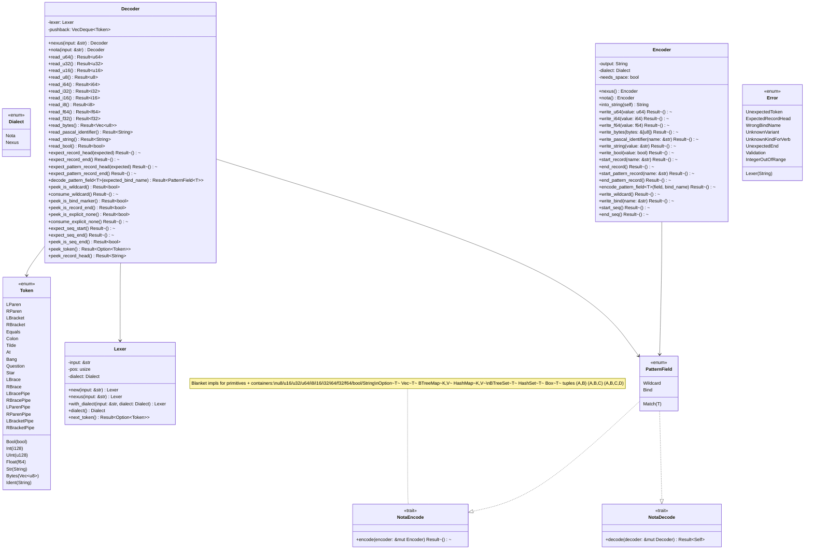

### 4b · Module relationships

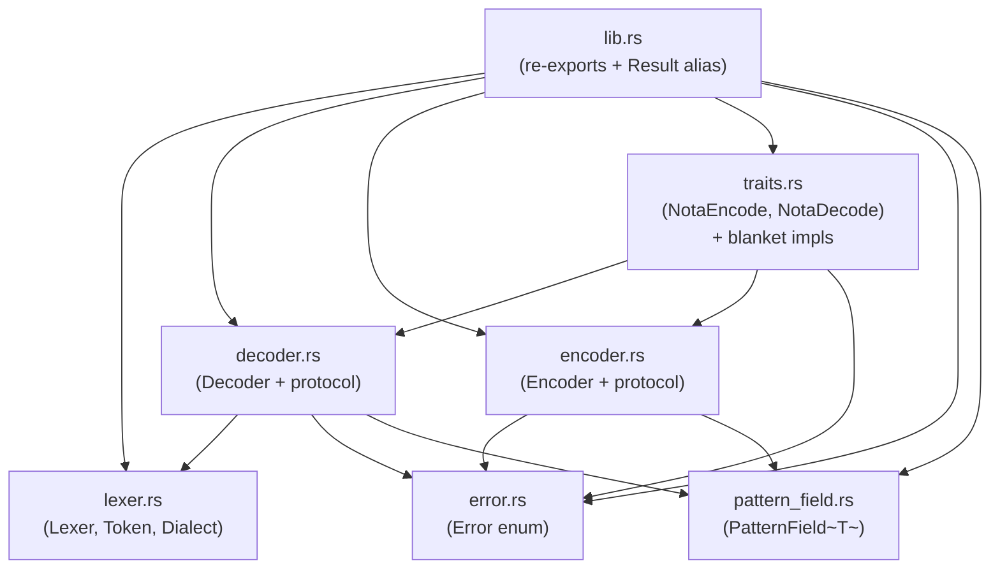

---

## 5 · `nota-derive` — proc-macro derives

Six derives that map any record kind to its wire form by
emitting `NotaEncode` + `NotaDecode` impls (and conversions
where applicable).

### 5a · Derive table

| Derive | Accepts | Emits | Wire form | Use site (signal types) |
|---|---|---|---|---|
| `NotaRecord` | named-field struct or unit struct | `NotaEncode` + `NotaDecode` | `(TypeName field0 field1 …)` | `Node`, `Edge`, `Graph`, `Ok`, `KindDecl`, `FieldDecl`, `RetractOperation` |
| `NotaEnum` | unit-variant enum | `NotaEncode` + `NotaDecode` | PascalCase identifier (`Flow`, `DependsOn`, …) | `RelationKind`, `Cardinality`, `DiagnosticLevel`, `Applicability` |
| `NotaTransparent` | tuple struct, single field | `NotaEncode` + `NotaDecode` + `From<inner>` + `From<Self> for inner` | bare inner value (invisible wrapper) | `Slot`, `Revision` |
| `NotaTryTransparent` | tuple struct + `fn try_new(inner) -> Result<Self, E>` | `NotaEncode` + `NotaDecode` + `From<Self> for inner` (no `From<inner>`) | bare inner value (validated) | (schema support; no current site) |
| `NexusPattern` | named-field struct of `PatternField<T>` + `#[nota(queries = "Name")]` | `NotaEncode` + `NotaDecode` | `(\| RecordName field0 field1 … \|)` | `NodeQuery`, `EdgeQuery`, `GraphQuery`, `KindDeclQuery` |
| `NexusVerb` | closed enum (newtype or struct variants) | `NotaEncode` + `NotaDecode` | variant name as record head; peeks head for dispatch | `AssertOperation`, `MutateOperation`, `QueryOperation`, `BatchOperation` |

### 5b · Derive expansion path

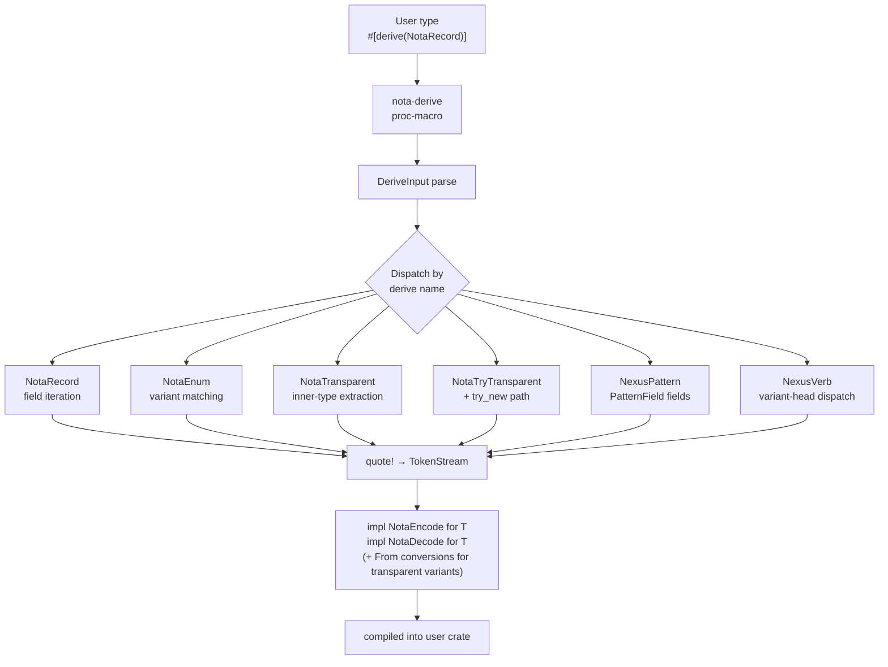

### 5c · Attribute

`NexusPattern` is the only derive that requires an attribute:
`#[nota(queries = "Name")]` names the data record whose wire
form (not the query type's Rust name) appears in the
pattern-record encoding. Used by every `*Query` type in
`signal`.

---

## 6 · `signal` — wire envelope + per-verb typed payloads

All types derive `Archive + RkyvSerialize + RkyvDeserialize`
for wire transport. Stereotypes (`<<NotaRecord>>`, `<<NexusVerb>>`,
etc.) indicate which `nota-codec` derive each type uses for
its text form.

### 6a · Wire envelope

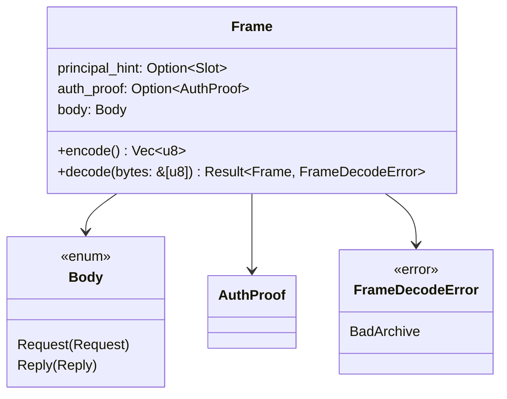

### 6b · Request and Reply

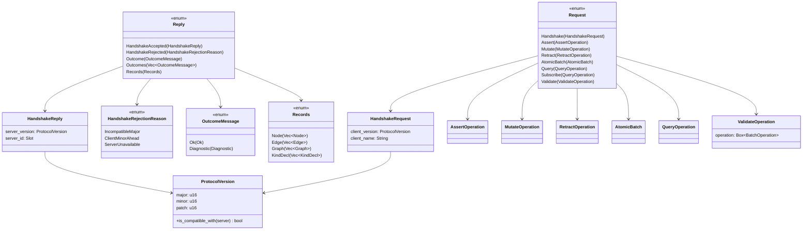

### 6c · Per-verb operation enums

```mermaid
classDiagram
    class AssertOperation {
        <<NexusVerb>>
        Node(Node)
        Edge(Edge)
        Graph(Graph)
        KindDecl(KindDecl)
    }

    class MutateOperation {
        <<NexusVerb>>
        Node{slot, new, expected_rev}
        Edge{slot, new, expected_rev}
        Graph{slot, new, expected_rev}
        KindDecl{slot, new, expected_rev}
    }

    class RetractOperation {
        <<NotaRecord>>
        slot: Slot
        expected_rev: Option~Revision~
    }

    class AtomicBatch {
        <<rkyv-only>>
        operations: Vec~BatchOperation~
    }

    class BatchOperation {
        <<rkyv-only>>
        Assert(AssertOperation)
        Mutate(MutateOperation)
        Retract(RetractOperation)
    }

    class QueryOperation {
        <<NexusVerb>>
        Node(NodeQuery)
        Edge(EdgeQuery)
        Graph(GraphQuery)
        KindDecl(KindDeclQuery)
    }

    AssertOperation --> Node
    AssertOperation --> Edge
    AssertOperation --> Graph
    AssertOperation --> KindDecl
    MutateOperation --> Slot
    MutateOperation --> Revision
    RetractOperation --> Slot
    RetractOperation --> Revision
    BatchOperation --> AssertOperation
    BatchOperation --> MutateOperation
    BatchOperation --> RetractOperation
    AtomicBatch --> BatchOperation
    QueryOperation --> NodeQuery
    QueryOperation --> EdgeQuery
    QueryOperation --> GraphQuery
    QueryOperation --> KindDeclQuery
```

### 6d · Data kinds + supporting types

```mermaid
classDiagram
    class Node {
        <<NotaRecord>>
        name: String
    }

    class Edge {
        <<NotaRecord>>
        from: Slot
        to: Slot
        kind: RelationKind
    }

    class Graph {
        <<NotaRecord>>
        title: String
        nodes: Vec~Slot~
        edges: Vec~Slot~
        subgraphs: Vec~Slot~
    }

    class NodeQuery {
        <<NexusPattern>>
        name: PatternField~String~
    }

    class EdgeQuery {
        <<NexusPattern>>
        from: PatternField~Slot~
        to: PatternField~Slot~
        kind: PatternField~RelationKind~
    }

    class GraphQuery {
        <<NexusPattern>>
        title: PatternField~String~
    }

    class RelationKind {
        <<NotaEnum>>
        Flow
        DependsOn
        Contains
        References
        Produces
        Consumes
        Calls
        Implements
        IsA
    }

    class KindDecl {
        <<NotaRecord>>
        name: String
        fields: Vec~FieldDecl~
    }

    class FieldDecl {
        <<NotaRecord>>
        name: String
        type_name: String
        cardinality: Cardinality
    }

    class Cardinality {
        <<NotaEnum>>
        One
        Many
        Optional
    }

    class KindDeclQuery {
        <<NexusPattern>>
        name: PatternField~String~
    }

    class Slot {
        <<NotaTransparent>>
        -value: u64
        +from(u64) Slot
        +into() u64
    }

    class Revision {
        <<NotaTransparent>>
        -value: u64
        +from(u64) Revision
        +into() u64
    }

    class Hash {
        <<type alias>>
        [u8; 32]
    }

    class Ok {
        <<NotaRecord>>
    }

    class Diagnostic {
        level: DiagnosticLevel
        code: String
        message: String
        primary_site: Option~DiagnosticSite~
        context: Vec~(String, String)~
        suggestions: Vec~DiagnosticSuggestion~
        durable_record: Option~Slot~
    }

    class DiagnosticLevel {
        <<NotaEnum>>
        Error
        Warning
        Info
    }

    class DiagnosticSite {
        <<enum>>
        Slot(Slot)
        SourceSpan{offset, length, source}
        OperationInBatch(u32)
    }

    Node --> NodeQuery
    Edge --> EdgeQuery
    Edge --> Slot
    Edge --> RelationKind
    Graph --> GraphQuery
    Graph --> Slot
    KindDecl --> FieldDecl
    FieldDecl --> Cardinality
    Diagnostic --> DiagnosticLevel
    Diagnostic --> DiagnosticSite
    DiagnosticSite --> Slot
```

---

## 7 · `sema` — record store

Single-file crate. `Sema::open / store / get / iter` over a
redb-backed records table + a meta table holding the slot
counter.

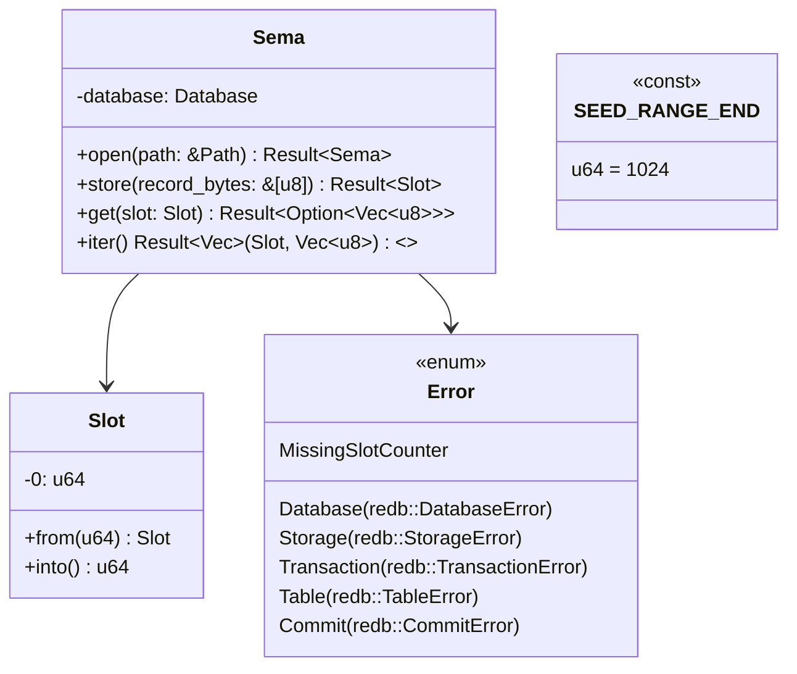

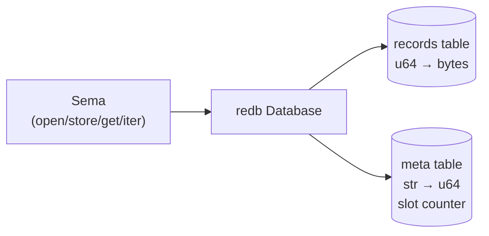

---

## 8 · `nexus` — text translator daemon

Five nouns. `Daemon` is the long-running entry; `Connection`
runs per accepted client; `CriomeLink` encapsulates the
post-handshake invariant; `Parser` and `Renderer` own the
text-↔-typed boundary.

### 8a · Nouns

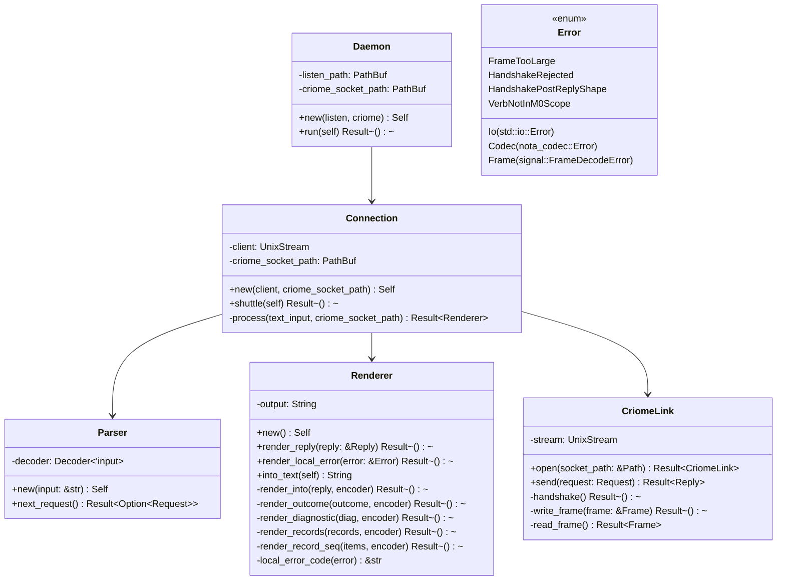

### 8b · Per-connection sequence

```mermaid
sequenceDiagram
    participant Client as client
    participant Daemon as Daemon
    participant Conn as Connection
    participant Parser as Parser
    participant Link as CriomeLink
    participant Criome as criome
    participant Render as Renderer

    Client->>Daemon: UDS connect
    Daemon->>Conn: new(client, criome_socket_path)
    Daemon-->>Client: (task spawned)

    Client->>Conn: nexus text (read until EOF)
    Conn->>Parser: Parser::new(text)
    Conn->>Parser: next_request()
    Parser-->>Conn: Some(Request)

    Note over Conn,Link: First request opens link
    Conn->>Link: CriomeLink::open(criome_socket_path)
    Link->>Criome: Frame{Handshake}
    Criome-->>Link: Frame{HandshakeAccepted}
    Link-->>Conn: CriomeLink (post-handshake)

    Conn->>Link: send(request)
    Link->>Criome: Frame{Request}
    Criome-->>Link: Frame{Reply}
    Link-->>Conn: Reply
    Conn->>Render: render_reply(&reply)
    Render-->>Conn: ()

    loop while parser yields more
        Conn->>Parser: next_request()
        Parser-->>Conn: Some(Request) | None
        Conn->>Link: send(request)
        Link->>Criome: Frame{Request}
        Criome-->>Link: Frame{Reply}
        Link-->>Conn: Reply
        Conn->>Render: render_reply(&reply)
    end

    Conn->>Render: into_text(self)
    Render-->>Conn: String
    Conn->>Client: write_all(text bytes)
```

---

## 9 · `criome` — sema's engine daemon

`Daemon` is the central noun owning `Arc<Sema>`. Per-verb
logic lives in sibling `impl Daemon { … }` blocks across
`dispatch.rs` / `handshake.rs` / `assert.rs` / `query.rs` —
all of which extend the same `Daemon` type. `Listener` holds
the UDS accept loop and shuttles frames through `Daemon`.

### 9a · Nouns

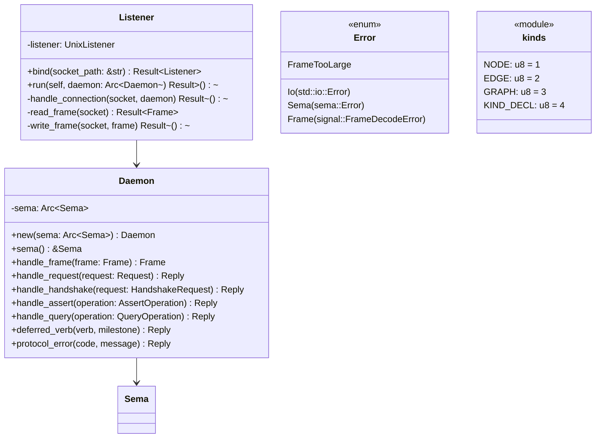

**Note on `kinds`**: the 1-byte discriminator is M0
scaffolding. rkyv `bytecheck` doesn't catch type-punning
between same-size archives, so the tag gates the try-decode.
M1+ replaces this with per-kind redb tables in sema; the
`kinds` module disappears then.

### 9b · One Frame's journey

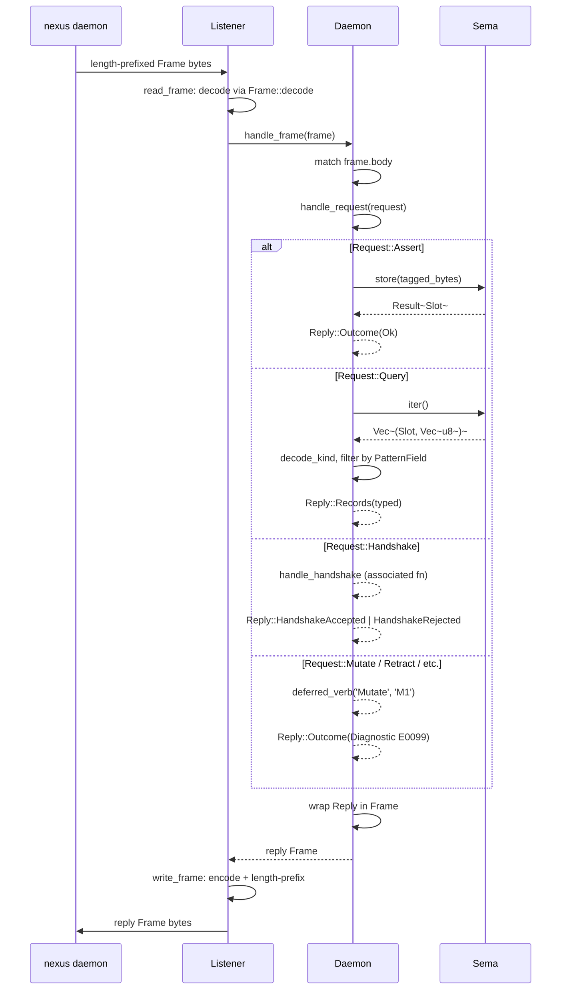

---

## 10 · `nexus-cli` — text shuttle client

Single noun. Stateless one-shot per invocation per
[`nexus-cli/ARCHITECTURE.md`](../repos/nexus-cli/ARCHITECTURE.md)
§Invariants.

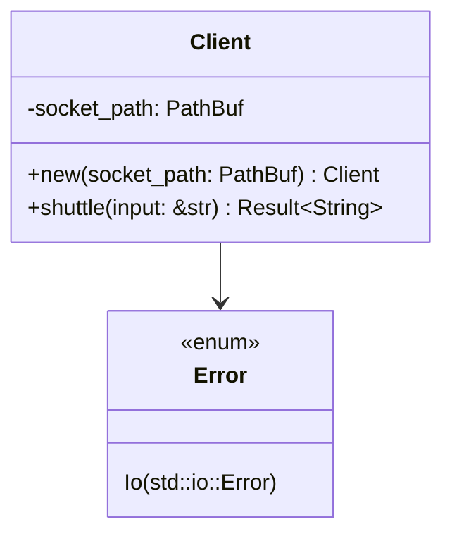

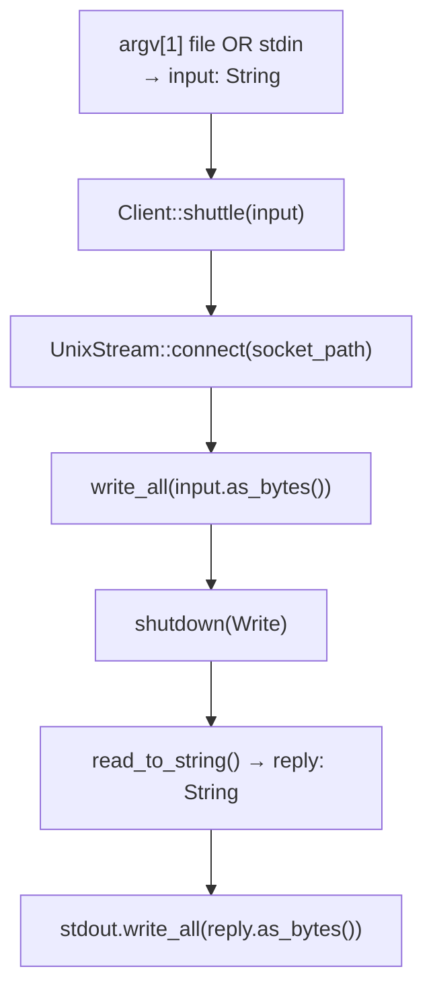

---

## 11 · Maintenance

This document is a snapshot. Per AGENTS.md "Delete wrong
reports; don't banner": when the system shape changes
materially (M1 lands, kind-tag scaffolding goes away,
nexus-cli grows beyond byte shuttle, lojix-schema lands as
real CANON), regenerate this report rather than patching it.

The agent prompts that produced these diagrams are reusable
— see the conversation log for 2026-04-27 (Phase 1 synthesis
+ Phase 2 per-repo agents pattern).

---

*End 102.*
